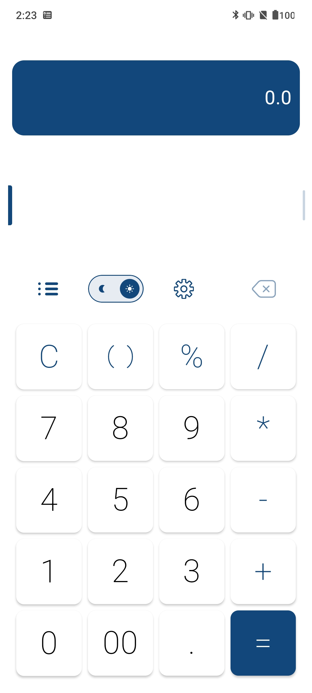
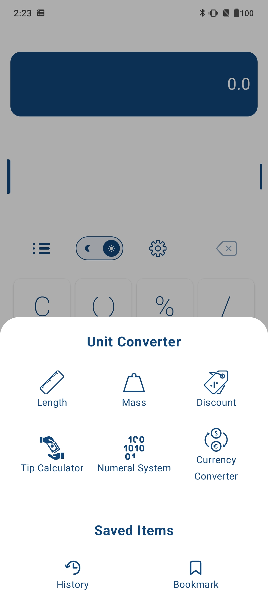
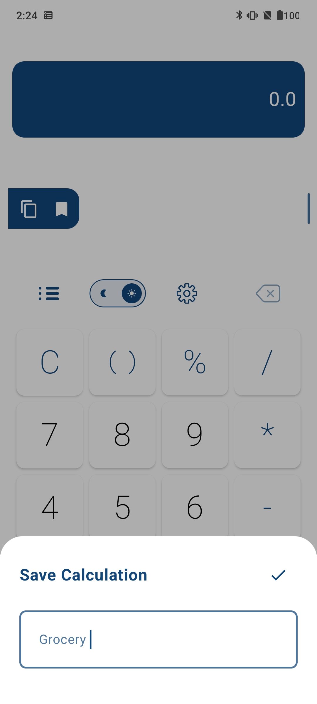
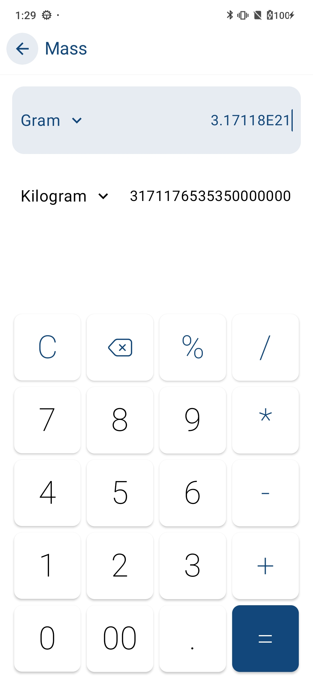
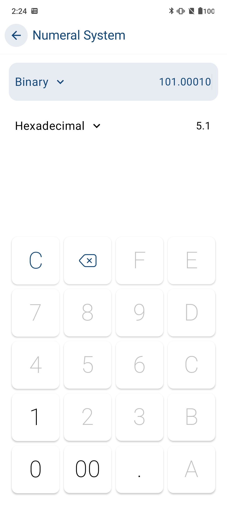
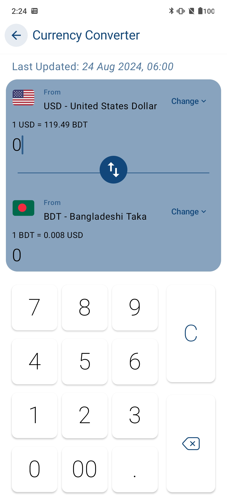
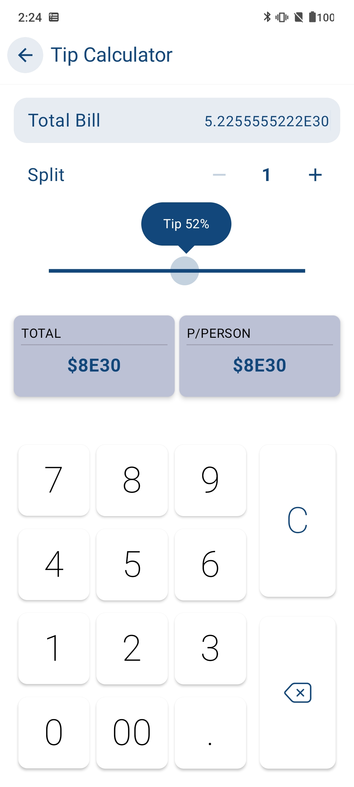
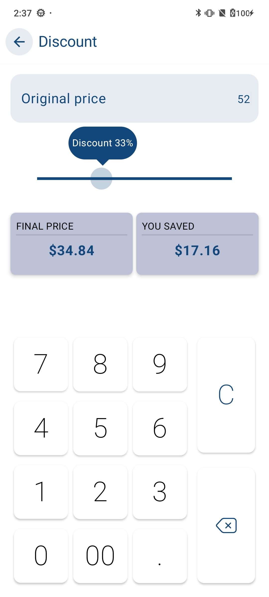

# MathMate — Multi-Feature Android Calculator Suite

A production-quality Android calculator application built with **Clean Architecture + MVVM**, featuring 8 specialised screens, persistent state, live data, and a fully themeable UI.

## Architecture & Tech Stack

| Layer | Technology |
|---|---|
| UI | Jetpack Compose · Material 3 · Navigation Compose |
| State / Logic | ViewModel · Kotlin `mutableStateOf` |
| Dependency Injection | Dagger Hilt |
| Persistence | Room Database (History, Bookmarks) · DataStore Preferences (Settings, per-screen state) |
| Networking | Retrofit + OkHttp (live currency exchange rates) |
| Architecture | Clean Architecture — `data / domain / presentation` per feature |

## Features

### 1. Scientific-style Calculator
Arithmetic (+ − × ÷ %), parentheses, a custom expression parser/evaluator (`ExpressionEvaluator`), copy-to-clipboard, auto-bookmark, history, and bookmarks stored in Room.

### 2. Live Currency Converter
Fetches real-time exchange rates from an external API via Retrofit. Supports all major currencies with swap, per-currency blinking cursor, and offline fallback via DataStore cache.

### 3. Length Converter
Conversions between 10 units (m, km, cm, mm, µm, nm, mi, yd, ft, in)

### 4. Mass / Weight Converter
Conversions between 10 units (g, kg, mg, µg, t, ton, lb, oz, st, ct)

### 5. Numeral System Converter
Binary ↔ Octal ↔ Decimal ↔ Hexadecimal. Keyboard dynamically disables digits invalid for the current base.

### 6. Discount Calculator
Enter price, drag a slider for the discount percentage, instantly see final price and amount saved.

### 7. Tip Calculator
Enter bill amount, set tip percentage via slider, split across N people; shows per-person amount in real time.

### 8. History & Bookmarks
Full calculation history (grouped) and named bookmarks, both backed by Room with multi-select delete.

### 9. Settings
Dark / light theme toggle + multiple accent colour themes, haptic feedback, double-zero button, keep-screen-awake — all persisted in DataStore.

## Screenshots

### Calculator

  
  
  

### Converter

  
  
  

  
  

