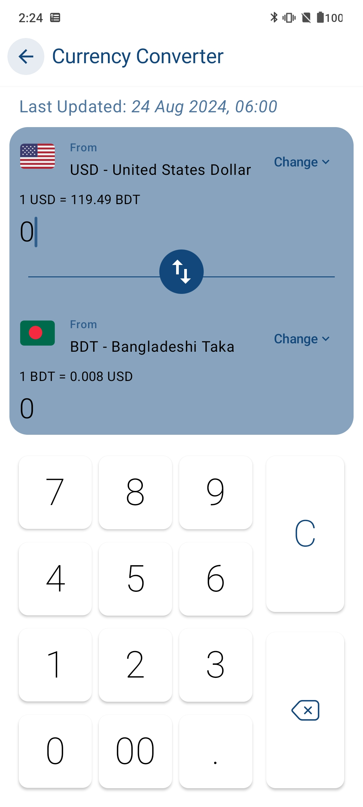

# MathMate

MathMate is a calculator app built with a clean architecture using the MVVM pattern. Developed with Jetpack Compose for a modern Android UI, MathMate offers a comprehensive suite of features, including basic arithmetic operations, unit conversions, numeral system conversions, currency conversion, and specialized calculations for discounts and tips.

## Features

### 1. Simple Calculation

- Perform basic arithmetic operations such as addition, subtraction, multiplication, and division.

### 2. Length and Mass Conversion

- Convert between different units of length (e.g., meters to feet) and mass (e.g., kilograms to pounds).

### 3. Numeral System Conversion

- Easily convert numbers between various numeral systems, including binary, octal, decimal, and hexadecimal.

### 4. Currency Conversion

- Get the latest currency exchange rates and convert between different currencies on the fly. Powered by Retrofit to fetch up-to-date rates from the web.

### 5. Discount and Tips Calculation

- Simplify your shopping and dining experiences with dedicated tools to calculate discounts and tips effortlessly.

## Tech Stack

- Jetpack Compose for building a responsive, modern UI; Dagger Hilt for clean, maintainable dependency injection; and Retrofit for fetching up-to-date currency exchange rates.

## Screenshots

### Simple Calculation

  
  
  

### Conversion

  
  
  

### Tips and Discount Calculation

  
  

